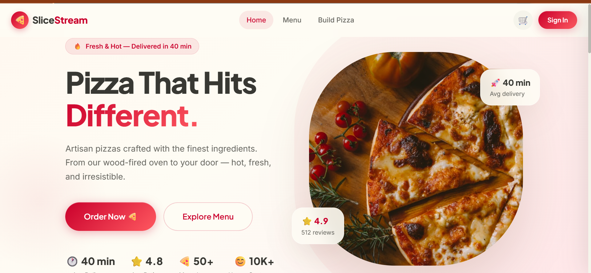
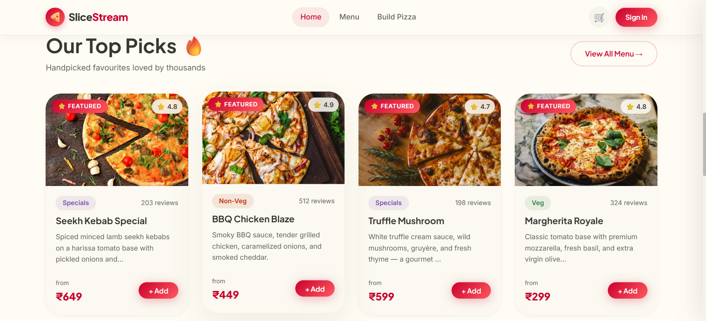
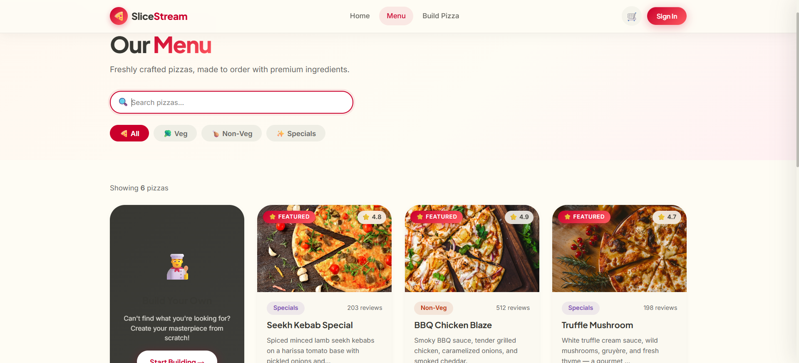
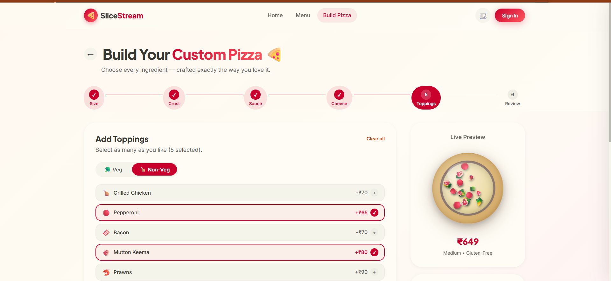
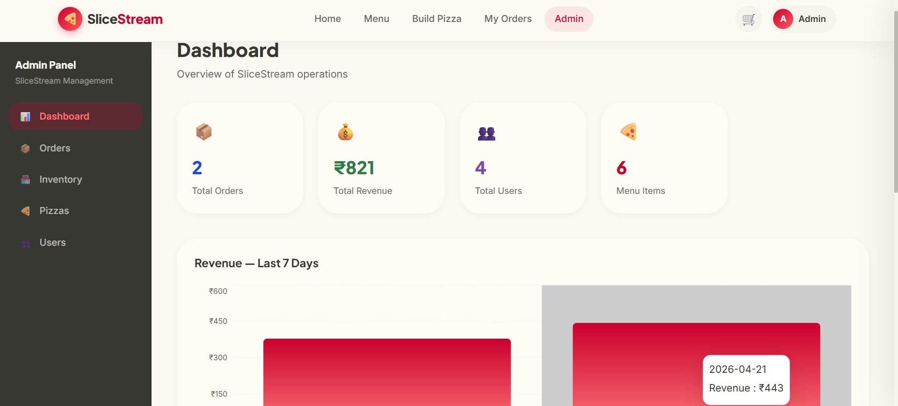
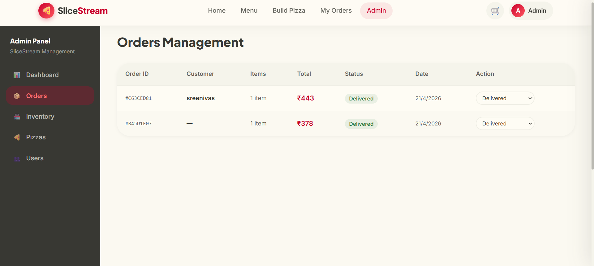
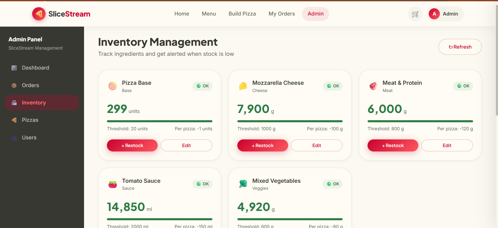
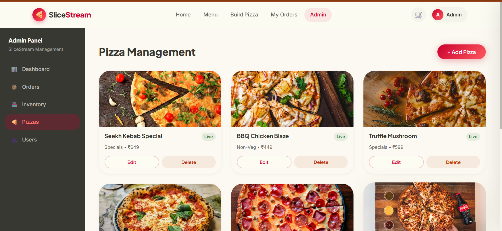

# 🍕 SliceStream – Pizza Delivery Web App

A modern full-stack pizza delivery web application built using the MERN stack during my internship at Oasis Infobyte.
SliceStream delivers a seamless food ordering experience with real-time updates, secure authentication, and an intuitive admin dashboard.

---

## 🚀 Features

* 🛒 Browse pizzas with a responsive and modern UI
* 🔐 Secure user authentication (JWT + Email Verification)
* 📦 Real-time order tracking system
* 💳 Integrated online payments using Razorpay
* 🧑‍💼 Admin dashboard for managing orders & inventory
* 📊 Inventory management with full CRUD operations
* ⚡ Fast and scalable RESTful API architecture

---

## 🛠️ Tech Stack

**Frontend:** React.js, Tailwind CSS
**Backend:** Node.js, Express.js
**Database:** MongoDB
**Authentication:** JWT
**Payments:** Razorpay

---

## 📸 Screenshots

### 🏠 Homepage



---

### 🍕 Featured Pizzas



---

### 📋 Menu Page



---

### 🧑‍🍳 Build Your Own Pizza



---

### 📊 Admin Dashboard



---

### 📦 Orders Management



---

### 📦 Inventory Management



---

### 🍕 Pizza Management (Admin)



---

## 🎥 Demo Video

(Add your YouTube demo link here)

---

## ⚙️ How to Run the Project

### 🔹 1. Run Backend Server

```bash
cd server
npm install
npm run dev
```

---

### 🔹 2. Run Frontend Client

Open a new terminal:

```bash
cd client
npm install
npm start
```

---

### 🔹 3. Access the Application

* Frontend: http://localhost:3000
* Backend: http://localhost:5000

---

## 🔐 Environment Variables

Create a `.env` file in the **server** folder and add:

```env
MONGO_URI=your_mongodb_connection_string
JWT_SECRET=your_secret_key
RAZORPAY_KEY_ID=your_key_id
RAZORPAY_KEY_SECRET=your_key_secret
```

---

## 📂 Project Structure

```bash
SliceStream/
│── client/        # React frontend
│── server/        # Node.js backend
│── screenshots/   # Project images
│── README.md
```

---

## 📌 Internship Details

This project was developed as part of my Web Development Internship at Oasis Infobyte.

---

## 💡 Learning Outcomes

* Built a complete MERN stack application from scratch
* Implemented secure authentication and payment integration
* Designed RESTful APIs for scalable communication
* Improved UI/UX design and state management
* Gained real-world experience in full-stack development

---

## 🙌 Author

**Surya A**
Full Stack Developer | MERN Stack

---

## ⭐ Support

If you found this project useful, feel free to ⭐ the repository and share your feedback!
